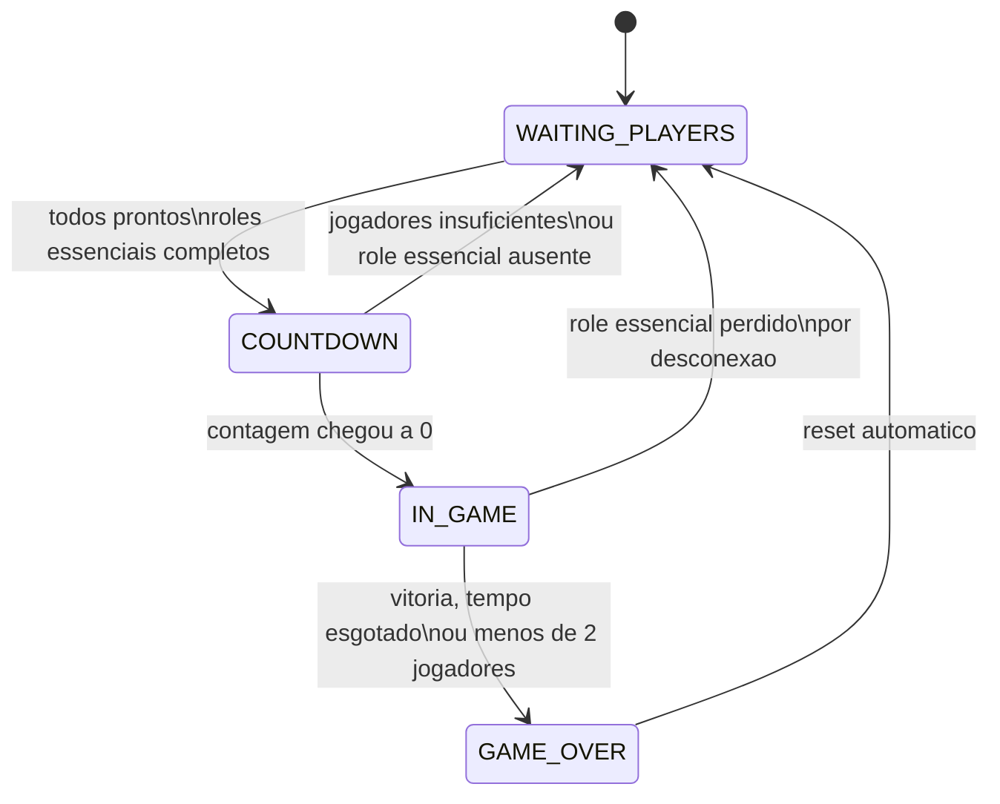
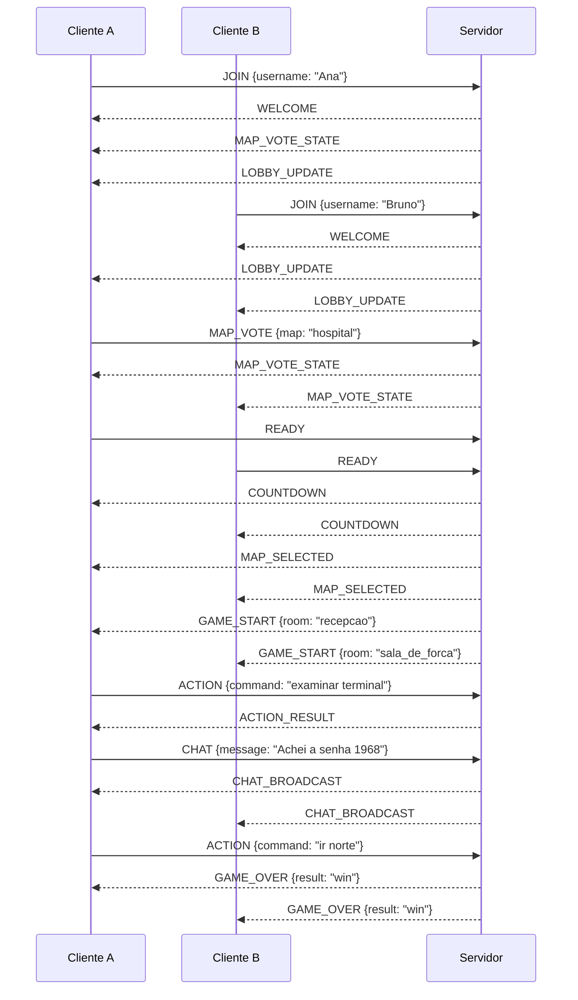

# Escape Room Cooperativo - ERP/1.0

Projeto final da disciplina de Redes de Computadores I - UESC.

**Alunos:** Arthur Araujo, Bruno Cardoso, Joao Pedro Franca e Lucas Vieira  
**Aplicacao:** jogo cooperativo de Escape Room em terminal, para 2 a 4 jogadores, usando arquitetura cliente-servidor, sockets TCP e um protocolo de aplicacao proprio: **ERP/1.0 - Escape Room Protocol**.

---

## Sumario

1. [Proposito da aplicacao](#1-proposito-da-aplicacao)
2. [Arquitetura geral da solucao](#2-arquitetura-geral-da-solucao)
3. [Motivacao da escolha do protocolo de transporte](#3-motivacao-da-escolha-do-protocolo-de-transporte)
4. [Requisitos minimos de funcionamento](#4-requisitos-minimos-de-funcionamento)
5. [Funcionamento da aplicacao](#5-funcionamento-da-aplicacao)
6. [Protocolo de aplicacao ERP/1.0](#6-protocolo-de-aplicacao-erp10)
7. [Subprotocolo de descoberta de servidor por UDP broadcast](#7-subprotocolo-de-descoberta-de-servidor-por-udp-broadcast)
8. [Limitacoes conhecidas](#8-limitacoes-conhecidas)
9. [Instrucoes de execucao](#9-instrucoes-de-execucao)
10. [Comandos uteis para apresentacao](#10-comandos-uteis-para-apresentacao)

---

## 1. Proposito da aplicacao

A aplicacao implementa um **jogo de Escape Room cooperativo em rede local**. Entre 2 e 4 jogadores entram na mesma partida, sao distribuidos entre dois caminhos ou papeis diferentes do mapa e precisam resolver enigmas que dependem um do outro, trocando informacoes pelo chat embutido no proprio jogo, ate alcancarem juntos a saida dentro de um tempo limite.

O objetivo didatico do projeto e exercitar, na pratica, conceitos centrais da disciplina de Redes de Computadores:

- comunicacao cliente-servidor sobre sockets;
- definicao de um protocolo de aplicacao proprio;
- delimitacao de mensagens sobre um fluxo TCP;
- serializacao e desserializacao de mensagens em JSON;
- maquina de estados do servidor;
- tratamento de erros de protocolo e de jogo;
- concorrencia com multiplos clientes;
- gerenciamento de estado global compartilhado;
- tolerancia a falhas de rede, como quedas de conexao e desconexoes no meio da partida.

O servidor e a **fonte unica de verdade** do jogo. Ele mantem o estado de cada jogador, das salas, dos objetos, dos enigmas, dos inventarios, do tempo restante e da condicao de vitoria ou derrota. Os clientes nunca alteram o estado diretamente; eles apenas enviam comandos e recebem atualizacoes processadas e autorizadas pelo servidor.

---

## 2. Arquitetura geral da solucao

A solucao e dividida em modulos independentes, mas integrados:

| Arquivo | Responsabilidade |
|---|---|
| `server.py` | Servidor TCP. Aceita conexoes, mantem a maquina de estados da partida, processa mensagens e decide se a resposta sera enviada a um cliente especifico, a todos os clientes ou apenas aos jogadores de uma sala. |
| `client.py` | Cliente de terminal. Envia comandos digitados pelo jogador, executa o handshake de entrada, renderiza mensagens recebidas do servidor e preserva o prompt durante mensagens assincronas. |
| `launcher.py` | Interface de conveniencia. Permite criar uma partida local ou encontrar automaticamente um servidor na rede por UDP broadcast. |
| `game/protocol.py` | Define tipos de mensagens, constantes do jogo, estados do servidor, codigos de erro e funcoes de serializacao JSON. |
| `game/state.py` | Contem a logica de jogo: jogadores, inventario, salas, enigmas, parser de comandos, aliases, movimentacao, anti-softlock e atualizacoes de sala. |
| `game/rooms.py` | Define o mapa Hospital Abandonado, seus caminhos, salas, objetos, saidas, senhas, dicas e papeis necessarios. |

O servidor usa uma arquitetura **single-process e multi-thread**. A thread principal aceita conexoes (`accept`) e cria uma thread dedicada para cada cliente conectado. Cada thread de cliente fica bloqueada lendo linhas do socket daquele jogador e, quando recebe uma mensagem completa, repassa essa mensagem ao servidor para processamento.

Como varias threads podem tentar ler ou alterar a mesma instancia de `GameState` e o mesmo dicionario de conexoes, o servidor protege as secoes criticas com `threading.Lock`. Assim, acoes concorrentes, como dois jogadores tentando pegar o mesmo item ao mesmo tempo, sao serializadas e nao corrompem o estado compartilhado.

---

## 3. Motivacao da escolha do protocolo de transporte

O protocolo principal do jogo, **ERP/1.0**, roda sobre **TCP**. Essa escolha foi feita porque o jogo depende de uma maquina de estados compartilhada e sensivel a ordem dos eventos.

### 3.1. Entrega confiavel

O TCP garante que os dados enviados sejam entregues ou que a conexao seja considerada quebrada. Isso e importante porque uma mensagem `ACTION`, `ROOM_UPDATE` ou `GAME_OVER` perdida poderia deixar clientes e servidor com percepcoes diferentes do jogo.

Exemplo: se o cliente enviasse `pegar chave_direita` e essa mensagem se perdesse silenciosamente, o jogador poderia acreditar que pegou a chave, enquanto o servidor continuaria com a chave disponivel na sala. Como o TCP e confiavel, esse tipo de perda silenciosa nao ocorre.

### 3.2. Ordem de chegada

As mensagens chegam na mesma ordem em que foram enviadas. Isso e essencial para preservar a consistencia do estado do jogo. Por exemplo, o servidor precisa processar `ir leste` antes de `pegar chave`, caso a chave esteja na sala de destino.

Se as mensagens chegassem fora de ordem, uma acao poderia ser rejeitada ou processada sobre um estado errado. O TCP evita esse problema por construcao.

### 3.3. Conexao persistente

Cada jogador mantem uma conexao TCP aberta com o servidor durante toda a partida. Isso simplifica a identificacao de sessao: o servidor sabe qual socket pertence a qual jogador depois do `JOIN`, e pode enviar respostas individualizadas por essa mesma conexao.

### 3.4. Delimitacao de mensagens com JSON + quebra de linha

O TCP entrega um fluxo continuo de bytes, sem preservar fronteiras de mensagem. Por isso, o ERP/1.0 usa uma estrategia de enquadramento: cada mensagem e um objeto JSON finalizado por uma quebra de linha (`\n`).

Exemplo:

```json
{"type": "ACTION", "payload": {"command": "examinar mesa"}}
```

O servidor e o cliente acumulam bytes em um buffer e so decodificam uma mensagem quando encontram `\n`. Isso permite reconstruir corretamente mensagens mesmo que o TCP entregue um payload fragmentado em multiplos pacotes ou agrupe varias mensagens em um unico `recv()`.

### 3.5. Por que UDP nao foi usado no jogo principal?

O UDP nao garante entrega, ordem ou conexao persistente. Para o jogo principal, isso exigiria implementar manualmente confirmacoes, numeros de sequencia, retransmissoes e controle de sessao na camada de aplicacao. Como o Escape Room nao e um jogo de acao em tempo real com exigencia extrema de latencia, o TCP e mais adequado.

O UDP foi reservado apenas para uma funcao auxiliar: a descoberta automatica de servidor em rede local, explicada na [secao 7](#7-subprotocolo-de-descoberta-de-servidor-por-udp-broadcast). Nessa etapa, a perda de um pacote nao compromete o jogo, porque o anuncio e reenviado periodicamente.

---

## 4. Requisitos minimos de funcionamento

- Python 3.10 ou superior, pois o codigo usa anotacoes de tipo como `str | None`.
- Rede TCP/IP entre as maquinas.
- Porta TCP `5000` liberada no host do servidor.
- Mesma sub-rede local apenas se for usado o recurso de descoberta automatica do `launcher.py`, pois UDP broadcast nao atravessa roteadores por padrao.
- Porta UDP `5001` liberada se for usada a busca automatica de servidor pelo `launcher.py`.
- Terminal com suporte a UTF-8 e sequencias ANSI, ja que o cliente usa acentuacao, caracteres visuais e limpeza de linha de prompt.
- Modulo `readline` ou equivalente. Em Linux e macOS, geralmente ja existe. No Windows nativo, pode ser necessario instalar `pyreadline3` com:

```powershell
python -m pip install pyreadline3
```

ou:

```powershell
py -m pip install pyreadline3
```

- Entre 2 e 4 jogadores por partida, conforme `MIN_PLAYERS` e `MAX_PLAYERS`.

Para testes na mesma maquina, pode ser usado `127.0.0.1`. Em maquinas diferentes na mesma rede, os clientes devem conseguir acessar o IP e a porta TCP do servidor.

---

## 5. Funcionamento da aplicacao

### 5.1. Papeis, mapa e cooperacao

O mapa atual, **Hospital Abandonado**, possui dois caminhos essenciais:

- `role 0`: caminho da Recepcao;
- `role 1`: caminho da Sala de Forca.

Os caminhos sao inicialmente separados e convergem no **Corredor Central**.

A distribuicao de papeis e alternada conforme a quantidade de jogadores conectados:

| Quantidade de jogadores | Distribuicao de papeis |
|---|---|
| 2 jogadores | `role 0`, `role 1` |
| 3 jogadores | `role 0`, `role 1`, `role 0` |
| 4 jogadores | `role 0`, `role 1`, `role 0`, `role 1` |

Com isso, jogadores extras entram como apoio em caminhos ja existentes. O mapa nao cria `role 2` ou `role 3`; ele redistribui os jogadores entre os dois papeis essenciais.

Cada caminho contem pistas ou acoes que ajudam o outro caminho. Por exemplo, uma informacao encontrada em uma sala pode ser a senha necessaria para outro jogador avancar. O jogo nao anuncia automaticamente todo item encontrado; por isso, o comando `chat <mensagem>` e parte essencial da cooperacao.

Alguns eventos cooperativos mais criticos, como energia religada, porta destrancada remotamente e reencontro no Corredor Central, sao anunciados automaticamente via `PLAYER_EVENT` para evitar que uma virada de jogo importante passe despercebida.

A saida final do Corredor Central exige duas chaves fisicas distintas, uma de cada caminho. Cada chave deve ser usada em seu dispositivo correspondente.

### 5.1.1. Descricao das salas

| Sala | Descricao |
|---|---|
| Recepcao | Sala inicial dos jogadores do `role 0`. Contem objetos como o terminal de monitoramento e uma porta protegida por senha que permite avancar para novas areas do mapa. |
| Sala de Forca | Sala inicial dos jogadores do `role 1`. Possui o painel de controle responsavel por restaurar a energia do hospital e uma porta protegida por senha. |
| Consultorio | Area intermediaria do caminho da Recepcao. Contem pistas que ajudam o outro caminho. |
| Almoxarifado | Area intermediaria do caminho da Sala de Forca. Contem a valvula e pistas usadas na progressao. |
| Ala Medica | Area avancada do caminho da Recepcao. Contem o cofre medico e itens importantes para a conclusao da partida. |
| Subsolo | Area avancada do caminho da Sala de Forca. Contem a caixa de ferramentas, o servidor de TI e outros elementos necessarios para a conclusao. |
| Corredor Central | Area onde os dois caminhos convergem. Possui dispositivos que exigem cooperacao entre os jogadores. |
| Saida | Destino final da partida. A vitoria ocorre quando todas as condicoes necessarias para abertura da saida forem satisfeitas dentro do tempo limite. |

### 5.2. Comandos do jogador

| Categoria | Comandos |
|---|---|
| Comandos gerais | `ready`; `sair`; `chat <mensagem>`; `votar hospital`; `olhar`; `sala`; `inventario`; `dica` |
| Acoes de exploracao | `examinar <objeto>`; `pegar <objeto>` |
| Acoes de uso | `usar <item> em <objeto>`; `colocar <senha> no <objeto>` |
| Movimentacao | `ir norte`; `ir sul`; `ir leste`; `ir oeste` |

### 5.2.1. Normalizacao e facilitacao da digitacao

Para melhorar a usabilidade em uma interface de terminal, o jogo nao exige que o jogador digite sempre o identificador interno exato dos objetos. Antes de interpretar a entrada, o motor de jogo aplica uma etapa de normalizacao:

- converte o texto para minusculas;
- remove acentos;
- trata underscores (`_`) como espacos;
- trata hifens (`-`) como espacos;
- reduz multiplos espacos para um unico espaco.

Com isso, entradas como `Inventario`, `inventario` e `INVENTARIO` sao equivalentes. Tambem e possivel digitar nomes internos com espacos, sem underline.

Exemplos de equivalencia por normalizacao:

| Entrada do jogador | Objeto interno correspondente |
|---|---|
| `placa de alimentacao` | `placa_de_alimentacao` |
| `caixa de ferramentas` | `caixa_de_ferramentas` |
| `dispositivo esquerdo` | `dispositivo_esquerdo` |
| `dispositivo direito` | `dispositivo_direito` |
| `porta leste` | `porta_leste` |
| `porta sul` | `porta_sul` |

Alem da normalizacao, o jogo possui aliases especificos para alguns objetos importantes. Esses aliases foram verificados no codigo e so funcionam quando o jogador esta na sala correta e possui o papel que consegue ver aquele objeto.

| Entrada aceita pelo jogador | Objeto interno resolvido | Condicao de funcionamento |
|---|---|---|
| `examinar terminal` | `terminal_de_monitoramento` | Recepcao, jogador do `role 0` |
| `examinar painel` / `colocar 440 no painel` | `painel_de_controle` | Sala de Forca, jogador do `role 1` |
| `colocar 8520 na porta` | `porta_leste` | Recepcao, porta interativa visivel |
| `colocar 1968 na porta` | `porta_sul` | Sala de Forca, porta interativa visivel |
| `examinar cofre` / `colocar 9999 no cofre` | `cofre_medico` | Ala Medica |
| `examinar caixa` / `colocar 1234 na caixa` | `caixa_de_ferramentas` | Subsolo |
| `examinar servidor` / `colocar 7701 no servidor` | `servidor_de_ti` | Subsolo |
| `usar chave direita em dispositivo direito` | `chave_direita` + `dispositivo_direito` | Corredor Central, item no inventario |
| `usar chave esquerda em dispositivo esquerdo` | `chave_esquerda` + `dispositivo_esquerdo` | Corredor Central, item no inventario |
| `colocar 314 na valvula` | `valvula` | Almoxarifado; acento opcional em `valvula`/`válvula` |

A resolucao contextual de `porta` e uma regra especifica: quando a sala possui uma unica porta interativa visivel, o jogador pode digitar `colocar <senha> na porta`, sem precisar escrever `porta_leste` ou `porta_sul`. Na Recepcao, `porta` e resolvida como `porta_leste`; na Sala de Forca, `porta` e resolvida como `porta_sul`.

Nem toda abreviacao generica e aceita automaticamente. Se nao houver alias para uma palavra isolada, o jogador deve digitar um nome suficientemente proximo do objeto interno normalizado. Essa restricao evita ambiguidade quando existem varios objetos parecidos na mesma sala.

### 5.2.2. Sistema de dicas (`dica`)

Cada sala do mapa possui uma lista propria de dicas, definida estaticamente em `game/rooms.py`. O comando `dica` nao revela todas as dicas de uma vez: a cada chamada, o servidor entrega a proxima dica da lista da sala em que o jogador se encontra, avancando um indice interno mantido por sala.

Esse indice e compartilhado entre os jogadores que percorrem o mesmo caminho, e nao e reiniciado por jogador. Se um jogador pedir uma dica e, em seguida, outro jogador da mesma sala pedir novamente, ele recebe a dica seguinte da lista, nao a primeira. Quando todas as dicas de uma sala ja foram entregues, novas chamadas de `dica` retornam a mensagem `Sem mais dicas.`.

O indice de dicas e reiniciado junto com o restante do estado do mapa sempre que a partida e reiniciada, seja por vitoria, derrota, perda de papel essencial ou cancelamento de contagem regressiva.

A resposta ao comando `dica` e sempre enviada via `HINT`, em unicast, apenas ao jogador que solicitou.

### 5.2.3. Preservacao do prompt e conforto de digitacao no cliente

O cliente possui uma melhoria de interface para nao atrapalhar o jogador enquanto ele digita. Como mensagens do servidor podem chegar a qualquer momento, o cliente usa uma funcao de impressao controlada que limpa a linha atual, imprime a mensagem recebida e redesenha o prompt junto com o texto que o usuario estava digitando.

Essa estrategia evita que mensagens assincronas, como `CHAT_BROADCAST`, `TIMER_UPDATE` ou `PLAYER_EVENT`, quebrem visualmente o comando em construcao. Em ambientes com `readline` disponivel, o cliente consegue ler o conteudo atual da linha de entrada para restaura-lo apos a impressao da mensagem.

### 5.3. Escolha de nome do jogador

Ao abrir o cliente, o jogador informa um nome de usuario. Se esse nome ja estiver em uso por outro jogador conectado, o servidor responde `ERROR [NAME_TAKEN]`.

O cliente de referencia nao libera o loop normal de comandos nesse momento. Ele solicita outro nome ao usuario e envia novo `JOIN` na mesma conexao. O jogador so entra definitivamente no jogo depois que o servidor responde `WELCOME`.

### 5.4. Robustez contra desconexoes e anti-softlock

Como o mapa depende dos dois papeis essenciais, o servidor trata desconexoes com regras especificas.

- **No lobby:** se alguem sai, o servidor remove o jogador, remove o voto de mapa dele, redistribui os papeis dos jogadores restantes, limpa o estado `ready` e envia `LOBBY_UPDATE` e `MAP_VOTE_STATE`.
- **Durante o COUNTDOWN:** se o numero de jogadores cair abaixo do minimo ou um papel essencial ficar descoberto, a contagem e cancelada, o mapa e resetado e todos voltam ao lobby.
- **Durante a partida, com menos de 2 jogadores:** o jogo termina em derrota com `GAME_OVER`.
- **Durante a partida, com papel essencial vazio:** a partida e reiniciada automaticamente, com mapa resetado, inventarios limpos, papeis redistribuidos e jogadores de volta ao lobby.
- **Durante a partida, se o jogo puder continuar:** os itens do inventario do jogador desconectado sao devolvidos ao chao da sala onde ele estava, permitindo que outro jogador do mesmo caminho recupere esses itens sem refazer puzzles ja resolvidos.

Exemplo de item devolvido a sala:

```text
Bruno estava com chave_direita.
Bruno caiu.
Daniel ainda cobre o role 1.
A partida continua.
chave_direita volta para o chao da sala onde Bruno caiu.
Daniel pode usar: pegar chave direita.
```

Apos isso, o servidor envia `ROOM_UPDATE` aos jogadores que permaneceram naquela sala, atualizando a lista de presentes e os objetos disponiveis.

Essa logica evita dois tipos de softlock: iniciar ou continuar uma partida sem um caminho essencial ativo, ou perder para sempre um item essencial porque o jogador que o carregava desconectou.

---

## 6. Protocolo de aplicacao ERP/1.0

### 6.1. Formato geral das mensagens

Toda mensagem ERP/1.0 e um unico objeto JSON codificado em UTF-8, com os campos obrigatorios `type` e `payload`, seguido de uma quebra de linha (`\n`) como delimitador de quadro.

Estrutura geral:

```json
{
  "type": "TIPO_DA_MENSAGEM",
  "payload": {}
}
```

Exemplo:

```json
{"type": "ACTION", "payload": {"command": "examinar mesa"}}
```

Como o TCP entrega um fluxo continuo de bytes, servidor e cliente mantem buffers de leitura. Sempre que uma quebra de linha aparece, o conteudo anterior e tratado como uma mensagem completa. Se a linha recebida nao for JSON valido ou nao contiver `type`/`payload`, o servidor responde `ERROR [INVALID_ACTION]` e descarta a linha.

### 6.2. Maquina de estados do servidor

| Estado | Significado |
|---|---|
| `WAITING_PLAYERS` | Lobby. Jogadores podem entrar, votar no mapa e confirmar `ready`. |
| `COUNTDOWN` | Contagem regressiva antes da partida. Nao permite novos jogadores. |
| `IN_GAME` | Partida em andamento. Jogadores enviam `ACTION` e `CHAT`; o servidor controla cronometro e estado das salas. |
| `GAME_OVER` | Partida encerrada por vitoria ou derrota. Depois de alguns segundos, o servidor reseta para `WAITING_PLAYERS`. |

### 6.3. Transicoes principais

```text
[*] -> WAITING_PLAYERS
WAITING_PLAYERS -> COUNTDOWN: todos prontos e roles essenciais completos
COUNTDOWN -> WAITING_PLAYERS: jogadores insuficientes ou role essencial ausente
COUNTDOWN -> IN_GAME: contagem chegou a 0
IN_GAME -> WAITING_PLAYERS: role essencial perdido por desconexao
IN_GAME -> GAME_OVER: vitoria, tempo esgotado ou menos de 2 jogadores
GAME_OVER -> WAITING_PLAYERS: reset automatico apos alguns segundos
```

Tambem e possivel representar a maquina de estados em Mermaid:



A transicao de `IN_GAME` direto para `WAITING_PLAYERS` e deliberada. Quando a partida e reiniciada por perda de um papel essencial, nao houve vitoria nem derrota; houve uma condicao que tornaria a partida impossivel de terminar. Por isso, o servidor recomeça a partida em lobby.

### 6.4. Mensagens Cliente -> Servidor

| Mensagem | Payload | Estado valido | Efeito |
|---|---|---|---|
| `JOIN` | `{"username": str}` | `WAITING_PLAYERS`, antes de a conexao ter `player_id` | Tenta registrar jogador. Em sucesso, o servidor responde `WELCOME`; em falha, responde `ERROR` e a conexao pode tentar `JOIN` novamente. |
| `READY` | `{}` | `WAITING_PLAYERS` | Marca jogador como pronto; se todos estiverem prontos e os roles essenciais estiverem completos, inicia `COUNTDOWN`. |
| `MAP_VOTE` | `{"map": str}` | `WAITING_PLAYERS` | Registra ou substitui voto de mapa. Atualmente existe apenas `hospital`. |
| `ACTION` | `{"command": str}` | `IN_GAME` | Executa comando de jogo no `GameState`. Fora de `IN_GAME`, gera `ERROR [NOT_IN_GAME]`. |
| `CHAT` | `{"message": str}` | Qualquer estado apos `JOIN` | Redistribui mensagem textual a todos via `CHAT_BROADCAST`. |
| `DISCONNECT` | `{}` | Qualquer estado | Saida voluntaria, tratada como desconexao. |

Qualquer tipo de mensagem desconhecido recebe `ERROR [INVALID_ACTION]`.

Qualquer mensagem que nao seja `JOIN`, enviada antes do jogador ter sido aceito, recebe `ERROR [INVALID_ACTION]` com a mensagem:

```text
Envie JOIN antes de qualquer outro comando.
```

### 6.4.1. Observacao sobre `READY`

A confirmacao de prontidao e unidirecional. Uma vez que o servidor recebe `READY` de um jogador, ele e marcado como pronto e nao ha, na versao atual do protocolo, uma mensagem para desfazer essa marcacao.

O estado de prontidao de todos os jogadores so e limpo automaticamente pelo servidor: ao entrar um novo jogador no lobby, ao reiniciar a partida ou ao cancelar a contagem regressiva. Um cliente mal-comportado nao tem como reverter sua propria confirmacao sem desconectar e reconectar.

### 6.4.2. Resolucao da votacao de mapa (`MAP_VOTE`)

Ao final do `COUNTDOWN`, o servidor apura os votos recebidos via `MAP_VOTE` e seleciona o mapa com maior numero de votos. Em caso de empate - incluindo o caso em que nenhum jogador votou - o servidor escolhe o primeiro mapa cadastrado internamente na lista de mapas disponiveis.

Como a versao atual do projeto possui apenas o mapa `hospital`, essa regra de desempate nao muda o resultado na pratica, mas a infraestrutura ja esta pronta para novos mapas no futuro.

### 6.5. Mensagens Servidor -> Cliente

| Mensagem | Tipo de envio | Quando e enviada |
|---|---|---|
| `WELCOME` | Unicast | Resposta direta a `JOIN` aceito. |
| `MAP_VOTE_STATE` | Unicast no `JOIN`; broadcast em `MAP_VOTE` | Informa votos atuais e mapas disponiveis. |
| `MAP_SELECTED` | Broadcast | Ao final do `COUNTDOWN`, quando o mapa vencedor e escolhido. |
| `LOBBY_UPDATE` | Broadcast | `JOIN`, `READY`, desconexao em lobby e reset automatico. |
| `COUNTDOWN` | Broadcast | A cada segundo da contagem regressiva. |
| `GAME_START` | Unicast individual | Inicio do jogo; cada jogador recebe sua propria sala inicial. |
| `ACTION_RESULT` | Unicast | Resultado direto do comando enviado pelo jogador. |
| `ROOM_UPDATE` | Broadcast ou envio direcionado por sala | Quando muda o estado visivel de uma sala: itens, portas, entrada/saida de jogadores ou item dropado. |
| `PLAYER_EVENT` | Broadcast | Eventos notaveis como `joined`, `left`, `solved`, `moved`, `countdown_cancelled` e `match_reset`. |
| `CHAT_BROADCAST` | Broadcast | Redistribuicao de mensagem enviada via `CHAT`. |
| `TIMER_UPDATE` | Broadcast | A cada 120 segundos ou em marcos criticos de tempo. |
| `HINT` | Unicast | Resposta ao comando `dica`. |
| `GAME_OVER` | Broadcast | Vitoria, derrota por tempo ou menos de 2 jogadores. |
| `ERROR` | Unicast | Rejeicao de mensagem ou erro de protocolo/jogo. |

### 6.5.1. Eventos de `PLAYER_EVENT`

A mensagem `PLAYER_EVENT` informa acontecimentos relevantes que nao sao simples respostas individuais a um comando. O payload segue a estrutura:

```json
{
  "event": "joined",
  "player": "Ana",
  "detail": "Ana entrou na partida."
}
```

Eventos usados pela aplicacao:

| Evento | Quando ocorre |
|---|---|
| `joined` | Quando um jogador entra na partida. |
| `left` | Quando um jogador sai voluntariamente ou cai da conexao. |
| `moved` | Quando ocorre um movimento cooperativo relevante, como chegada ao Corredor Central. |
| `solved` | Quando um enigma cooperativo importante e resolvido. |
| `match_reset` | Quando a partida e reiniciada por perda de um papel essencial. |
| `countdown_cancelled` | Quando a contagem regressiva e cancelada por falta de jogadores ou papeis essenciais. |

### 6.5.2. Unicast, broadcast e atualizacoes direcionadas

O servidor escolhe o destinatario de cada mensagem conforme sua finalidade.

- **Unicast:** usado quando a informacao interessa apenas a um jogador, como `WELCOME`, `GAME_START` individual, `ACTION_RESULT`, `HINT` e `ERROR`.
- **Broadcast:** usado quando todos precisam saber de uma mudanca global ou cooperativa, como `LOBBY_UPDATE`, `COUNTDOWN`, `MAP_SELECTED`, `PLAYER_EVENT`, `CHAT_BROADCAST`, `TIMER_UPDATE` e `GAME_OVER`.
- **`ROOM_UPDATE` hibrido:** em acoes comuns, pode ser transmitido a todos e filtrado no cliente por `players_here`. Em casos sensiveis, como desconexao com item dropado, o servidor envia a atualizacao apenas aos jogadores que continuam naquela sala, ja filtrando os objetos conforme o `role` de cada jogador.

Esse desenho evita trafego desnecessario e tambem impede que um jogador veja objetos exclusivos de outro caminho quando uma sala e compartilhada.

### 6.5.3. Funcionamento do chat

O chat e implementado com duas mensagens: o cliente envia `CHAT` com o texto digitado e o servidor redistribui `CHAT_BROADCAST` a todos os jogadores conectados. O chat nao depende do estado `IN_GAME`; basta o jogador ja ter concluido o `JOIN`.

A funcao do chat e central para a jogabilidade. Como o jogo nao anuncia automaticamente todo item encontrado, jogadores precisam compartilhar pistas, senhas e descobertas.

Exemplo:

Cliente -> Servidor:

```json
{"type": "CHAT", "payload": {"message": "Achei a senha 1968"}}
```

Servidor -> Todos:

```json
{"type": "CHAT_BROADCAST", "payload": {"from": "Ana", "message": "Achei a senha 1968"}}
```

### 6.5.4. Funcionamento de `ROOM_UPDATE`

`ROOM_UPDATE` e usado quando o estado visivel de uma sala muda:

- item foi pego;
- item apareceu;
- porta foi destrancada;
- jogador entrou na sala;
- jogador saiu da sala;
- item foi devolvido ao chao apos desconexao.

O payload inclui:

```json
{
  "room_state": {
    "name": "recepcao",
    "exits": {}
  },
  "objects": ["terminal_de_monitoramento", "porta_leste"],
  "players_here": ["Ana"]
}
```

Em acoes gerais, o servidor pode transmitir `ROOM_UPDATE` em broadcast, e o cliente renderiza apenas se o proprio jogador estiver em `players_here`. Em atualizacoes mais especificas, como desconexao com itens dropados, o servidor envia `ROOM_UPDATE` apenas para os jogadores que permanecem naquela sala. Nesses casos, a atualizacao tambem respeita o `role` do jogador, evitando que um cliente veja objetos que nao pertencem ao seu caminho.

### 6.5.5. Temporizacao e marcos criticos de tempo

Cada partida possui um limite de 30 minutos (`1800` segundos), contados a partir do envio do `GAME_START`. Esse valor e compartilhado por todos os jogadores e controlado inteiramente pelo servidor em uma thread dedicada (`_timer_loop`), que verifica o tempo restante a cada segundo.

O servidor envia `TIMER_UPDATE` em duas situacoes:

- periodicamente, a cada 120 segundos de jogo;
- em marcos criticos, quando o tempo restante atinge exatamente 300, 60, 30 ou 10 segundos.

Quando o tempo restante chega a zero, o servidor dispara automaticamente `GAME_OVER` com resultado de derrota (`lose`), encerrando a partida mesmo que os jogadores nao tenham percebido o aviso anterior.

### 6.5.6. Exemplos de mensagens ERP/1.0

#### Entrada de um jogador

Cliente -> Servidor:

```json
{
  "type": "JOIN",
  "payload": {
    "username": "Lucas"
  }
}
```

Servidor -> Cliente:

```json
{
  "type": "WELCOME",
  "payload": {
    "player_id": "abc123",
    "server_state": "WAITING_PLAYERS"
  }
}
```

#### Execucao de uma acao

Cliente -> Servidor:

```json
{
  "type": "ACTION",
  "payload": {
    "command": "examinar terminal"
  }
}
```

Servidor -> Cliente:

```json
{
  "type": "ACTION_RESULT",
  "payload": {
    "success": true,
    "message": "O terminal exibe uma sequencia numerica.",
    "state_changed": false
  }
}
```

#### Mensagem de erro

Servidor -> Cliente:

```json
{
  "type": "ERROR",
  "payload": {
    "code": "NOT_IN_GAME",
    "message": "A partida ainda nao foi iniciada."
  }
}
```

### 6.6. Codigos de erro

| Codigo | Quando e gerado |
|---|---|
| `NAME_TAKEN` | `JOIN` com nome de usuario ja utilizado por outro jogador conectado. |
| `GAME_FULL` | `JOIN` quando a partida ja atingiu 4 jogadores. |
| `GAME_IN_PROGRESS` | `JOIN` quando o servidor nao esta em `WAITING_PLAYERS`. |
| `INVALID_ACTION` | Nome vazio, mapa invalido, tipo desconhecido, JSON malformado ou comando antes do `JOIN`. |
| `NOT_IN_GAME` | `ACTION` enviada fora do estado `IN_GAME`. |

### 6.7. Fluxo resumido de uma partida



### 6.8. Concorrencia e consistencia

Cada cliente e atendido por uma thread dedicada. Como todas compartilham o `GameState` e o dicionario de conexoes, operacoes de `JOIN`, `READY`, `ACTION`, `CHAT` e desconexao sao processadas dentro de um lock.

Isso faz com que, do ponto de vista do estado do jogo, uma mensagem seja processada de cada vez, evitando corrupcao de estado em acoes concorrentes. Por exemplo, se dois jogadores tentarem pegar o mesmo item ao mesmo tempo, o servidor processa uma acao por vez. Depois que o primeiro jogador pega o item, o objeto deixa de estar disponivel; o segundo jogador recebe uma resposta coerente com o estado atualizado.

---

## 7. Subprotocolo de descoberta de servidor por UDP broadcast

O `launcher.py` implementa um subprotocolo auxiliar sobre UDP para que um jogador consiga encontrar automaticamente uma partida ja criada na rede local. Esse mecanismo nao substitui o ERP/1.0: ele so descobre onde esta o servidor TCP.

Quando alguem escolhe `Criar partida`, o launcher inicia o servidor TCP e, paralelamente, transmite periodicamente uma mensagem UDP broadcast na porta `5001`. A mensagem tem formato de texto simples, sem JSON:

```text
ESCAPE_ROOM_ERP1:<ip_do_servidor>:<porta_tcp_do_jogo>
```

Exemplo:

```text
ESCAPE_ROOM_ERP1:192.168.0.10:5000
```

Quando outro jogador escolhe `Entrar em partida`, o launcher abre um socket UDP na porta `5001` e escuta por ate alguns segundos. Se receber uma mensagem com o prefixo `ESCAPE_ROOM_ERP1:`, extrai o IP e a porta TCP e entao abre a conexao real do jogo via TCP. Se nada for encontrado, o cliente entra no modo manual e pede o IP do servidor por teclado.

### 7.1. Portas usadas

| Porta | Protocolo | Uso |
|---|---|---|
| `5000` | TCP | Comunicacao principal do jogo. |
| `5001` | UDP | Descoberta automatica de servidor pelo launcher. |

### 7.2. Passos ao criar partida

Quando o jogador escolhe:

```text
1. Criar partida
```

O `launcher.py`:

1. inicia o servidor TCP em `0.0.0.0:5000`;
2. detecta o IP local da maquina;
3. inicia uma thread de UDP broadcast;
4. envia a presenca do servidor a cada 2 segundos;
5. abre o cliente local conectado em `127.0.0.1`.

### 7.3. Passos ao entrar em partida

Quando o jogador escolhe:

```text
2. Entrar em partida
```

O `launcher.py`:

1. abre um socket UDP na porta `5001`;
2. escuta broadcasts por ate 6 segundos;
3. se encontrar uma mensagem `ESCAPE_ROOM_ERP1`, extrai IP e porta;
4. abre o cliente TCP conectado ao servidor encontrado;
5. se nao encontrar servidor, pede o IP manualmente.

### 7.4. Por que UDP aqui?

UDP e suficiente para a descoberta porque a mensagem e reenviada periodicamente. Se um pacote for perdido, outro sera enviado poucos segundos depois. Alem disso, broadcast e uma operacao natural em UDP. TCP e orientado a conexao ponto-a-ponto, entao nao serve para descobrir um servidor cujo IP ainda e desconhecido.

O uso de UDP aqui e propositalmente limitado a descoberta. O jogo em si permanece em TCP para garantir confiabilidade, ordem e conexao persistente.

---

## 8. Limitacoes conhecidas

### 8.1. Apenas um mapa jogavel

O projeto possui apenas um mapa jogavel, `hospital`, embora a infraestrutura de votacao (`MAP_VOTE`, `MAP_VOTE_STATE`, `MAP_SELECTED`) ja esteja preparada para multiplos mapas no futuro.

### 8.2. Descoberta automatica limitada a LAN

A auto-descoberta por UDP broadcast funciona apenas dentro do mesmo segmento de rede local. Em redes com isolamento de clientes, VPNs, firewalls restritivos ou multiplas sub-redes, o modo manual por IP deve ser usado.

### 8.3. Windows e `readline`

No Windows nativo, o cliente pode exigir `pyreadline3` ou execucao via WSL por causa do uso de `readline` para preservar melhor o input do usuario no terminal.

### 8.4. Segundo `JOIN` em cliente mal-comportado

O servidor documenta e tolera a repeticao de `JOIN` antes do `WELCOME` para o fluxo de nome ja usado. Esse comportamento e necessario porque, quando o nome esta repetido, o cliente precisa poder tentar outro nome na mesma conexao.

O cliente oficial so envia `JOIN` repetidamente durante esse fluxo, antes de receber `WELCOME`. Entretanto, do ponto de vista do servidor, um cliente mal-comportado que enviasse manualmente um segundo `JOIN` valido depois de ja autenticado poderia registrar um jogador extra compartilhando o mesmo socket. Esse caso nao ocorre no cliente de referencia, mas e uma limitacao conhecida do handler de `JOIN`.

---

## 9. Instrucoes de execucao

As dependencias completas ja estao descritas na [secao 4](#4-requisitos-minimos-de-funcionamento). Aqui o foco e nos comandos de execucao.

### 9.1. Forma recomendada: `launcher.py`

A maneira mais simples de rodar o jogo, especialmente em apresentacao, e atraves do launcher, que ja cuida da descoberta automatica de servidor via UDP broadcast.

No computador que sera o host:

```bash
python3 launcher.py
```

Em seguida, escolher:

```text
1. Criar partida
```

Esse computador inicia o servidor TCP, entra como jogador local e passa a transmitir periodicamente sua presenca na rede via UDP broadcast.

Nos computadores dos demais jogadores:

```bash
python3 launcher.py
```

Em seguida, escolher:

```text
2. Entrar em partida
```

O launcher tenta localizar automaticamente o servidor na rede local. Se encontrar, conecta sozinho; se nao encontrar, solicita o IP do servidor manualmente. Pressionar Enter no modo manual conecta em `127.0.0.1`.

### 9.2. Forma manual: `server.py` e `client.py`

Tambem e possivel rodar servidor e clientes separadamente, sem o launcher. Isso e util para depuracao ou quando o broadcast UDP nao esta disponivel.

No computador servidor:

```bash
python3 server.py
```

Por padrao, o servidor escuta em `0.0.0.0` na porta TCP `5000`. Host e porta podem ser sobrescritos:

```bash
python3 server.py --host 0.0.0.0 --port 5000
```

Nos computadores clientes:

```bash
python3 client.py --host IP_DO_SERVIDOR
```

Exemplo em rede local:

```bash
python3 client.py --host 192.168.0.10
```

Para testar tudo na mesma maquina:

```bash
python3 client.py --host 127.0.0.1
```

### 9.3. Gerando um executavel standalone (opcional)

Para distribuir o launcher sem exigir que o jogador execute o arquivo `.py` diretamente, e possivel empacotar o programa com o PyInstaller:

```bash
python -m pip install pyinstaller
pyinstaller --onefile launcher.py
```

O executavel gerado fica disponivel na pasta `dist/`. Essa etapa e opcional e nao substitui os requisitos da secao 4 no computador que efetivamente roda o servidor.

---

## 10. Comandos uteis para apresentacao

### Iniciar pelo launcher

```bash
python3 launcher.py
```

### Iniciar manualmente o servidor

```bash
python3 server.py
```

### Entrar manualmente como cliente

```bash
python3 client.py --host 127.0.0.1
```

ou:

```bash
python3 client.py --host IP_DO_SERVIDOR
```

### Comandos de jogo

```text
ready
votar hospital
olhar
inventario
dica
chat <mensagem>
examinar <objeto>
pegar <objeto>
usar <item> em <objeto>
colocar <senha> no <objeto>
ir norte
ir sul
ir leste
ir oeste
sair
```
